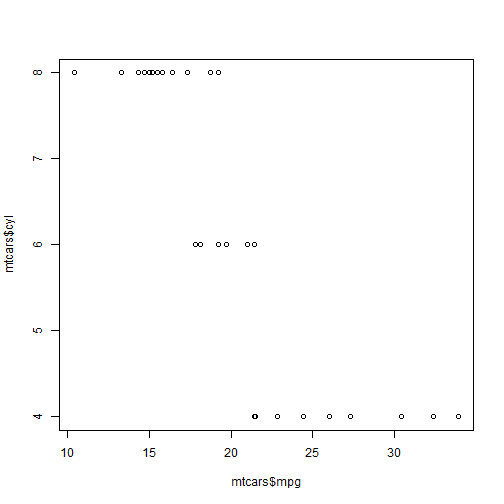

## Read-And-Delete

1. Edit YAML front matter
2. Write using R Markdown
3. Use an empty line followed by three dashes to separate slides!

--- .class #id 

## Slide 2

*Here* _comes_ my first code chunk  

[Come-and-enter-here!](http://www.kanubau.de)

here some latex-type $x^2$ formatting.


```r
a<-5
b<-6
c<-a+b
```

The result of this computation is 11.  

--- .class #id

## Slide 3


```
## Error in library("mtcars"): there is no package called 'mtcars'
```

 

--- .class #id

## Slide 4

nothing special here

--- .class #id


